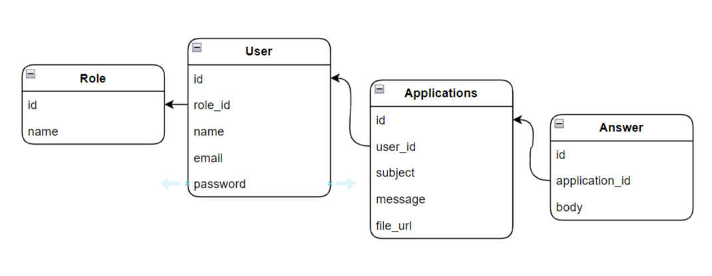

<p align="center"><a href="https://laravel.com" target="_blank"></a></p>


## Laravel Task

This project was created based on a task which was  given  to get a job at the company as a PHP developer. 

### Introduction

 Through this simple project, users or employees can write a message to the company manager or HR and upload a file (resume). The manager will be notified by email when each application is sent. Applications can be viewed by the user after the manager has reviewed and responded.

###Installation

```$xslt
composer create-project laravel/laravel laravel-task
```

\#Install `starter kits`

```
composer require laravel/breeze --dev
php artisan breeze:install
php artisan migrate
npm install
npm run dev
```
We have already got `user` table. So now we are going to create `Role` table

```$xslt
php artisan make:model Role -cms
```
Users have two roles: Manager and client.
```$xslt
php artisan make:Seeder UserSeeder
```

```$xslt
php artisan make:model Application -cms

php artisan storage:link

php artisan make:mail ApplicationCreated
```

`Mail_Mailer = log` to send emails to a log file 

`Queue_Connection = database`

`php artisan queue:table`

`php artisan make:job SendEmailJob`

## Contributing

Thank you for your attention. If you have any questions, you can contact with [Jurabek](https://github.com/mr-jurabekk).

### Model structure


